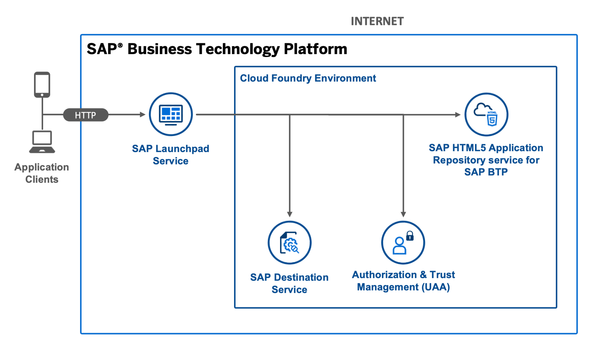
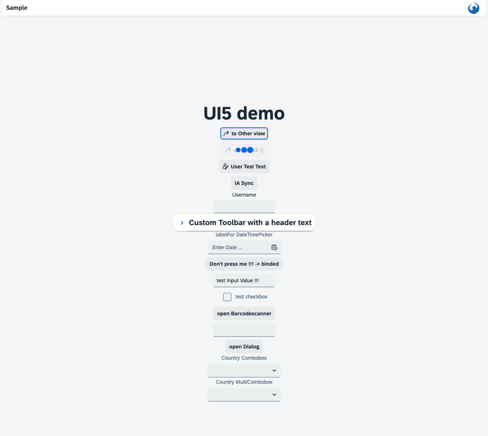

# Basic HTML5 App with a Managed Application Router

## Sources

[multi-cloud-html5-apps-samples](https://github.com/SAP-samples/multi-cloud-html5-apps-samples)

[cf-html5-apps-repo-cli-plugin](https://sap.github.io/cf-html5-apps-repo-cli-plugin/)

[managed-html5-runtime-basic-mta](https://github.com/SAP-samples/multi-cloud-html5-apps-samples/tree/main/managed-html5-runtime-basic-mta)

## Diagram



## Description

This is an example of an HTML5 app that is accessed by a managed application router and is integrated into the SAP Launchpad service. During the build process (`mbt build`), the app is compressed into a zip file. During the deployment (`cf deploy`), the HTML5 app is pushed to the HTML5 Application Repository and uses the Authentication & Authorization service (XSUAA service) and the destination service.

## Download and Deployment

1. Subscribe to the [SAP Launchpad service](https://developers.sap.com/tutorials/cp-portal-cloud-foundry-getting-started.html) if you haven't done so before.
1. Go to source code:

   ```sh
   cd examples/ui5-js-app
   ```

1. Build the project:

   ```sh
   npm install
   npm run build
   ```

1. Deploy the project:

   ```sh
   cf deploy mta_archives/wdi5-test-app_1.0.0.mtar
   ```

1. See the URL of the web app:

   ```shs
   cf html5-list -di wdi5-test-app-destination-service -u --runtime launchpad
   ```

> Use the following command in case you use the Portal service
>
> `cf html5-list -di wdi5-test-app-destination-service -u --runtime cpp`

## Check the Result

### List the Deployed HTML5 Apps

```sh
$ cf html5-list -di wdi5-test-app-destination-service -u --runtime launchpad
Getting list of HTML5 applications in org 9f10ed8atrial / space dev as firstname.lastname@domain.com...
OK

name         version   app-host-id                            service name    destination name                        last changed                    url
helloworld   1.0.0     bcd2d34a-1625-47ab-bf42-4f054970b911   basic.service   my_service_hello_world_html_repo_host   Tue, 16 Feb 2021 10:51:10 GMT   https://9f10ed8atrial.cpp.cfapps.eu10.hana.ondemand.com/7b673550-29f4-4b18-a128-6a4425018e6e.basicservice.helloworld-1.0.0/
```

> You need to substitute `cpp` with `launchpad`, in case you use the Launchpad service (instead of the Portal service).

### List the Deployed MTA

```sh
$ cf mta wdi5-test-app
Showing health and status for multi-target app wdi5-test-app in org 9f10ed8atrial / space dev as firstname.lastname@domain.com...
OK
Version: 1.0.0

Apps:
name   requested state   instances   memory   disk   urls

Services:
name                                 service           plan          bound apps   last operation
wdi5-test-app-destination-service      destination       lite                       create succeeded
wdi5-test-app-html5-app-host-service   html5-apps-repo   app-host                   create succeeded
wdi5-test-app-xsuaa-service            xsuaa             application                create succeeded

```

### Check the HTML5 App

Access the URL described in [Download and Deployment](#download-and-deployment) to view the web app. You are redirected to a sign-on page before you can see the web app.


