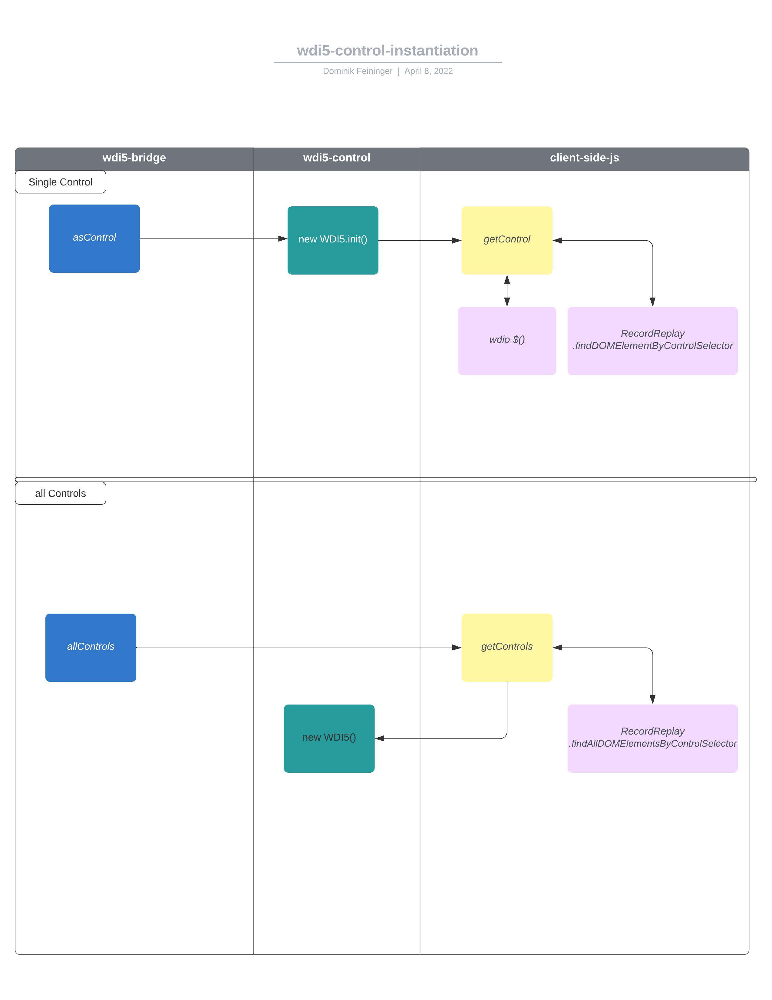

# get aboard ⛵️

"the more, the merrier" also holds true for contributions to `wdi5` 🤗

<!-- prettier-ignore-start -->

<!-- markdownlint-disable MD037 -->
?> `wdi5`'s technical name is `wdio-ui5-service`, as it adheres to the WebdriverIO standard naming of extensions aka "services"
<!-- markdownlint-enable MD037 -->

<!-- prettier-ignore-end -->

## 🏃 for the impatient developer

```shell
# use reference node version
$> nvm use
# you need npm 7+ → we're using npm's workspaces feature
$> npm --version
# eventually update npm itself with command:
$> npm install -g npm@latest
# will also install all deps in workspaces + setup pre-commit hooks
$> npm i
# build entire proj once
$> npm run build
# turn on build watcher
$> npm run build:watch
```

Then to work on a test:
...in terminal 1:

```shell
# start the sample js app
$> npm run _startApp:js
```

...in terminal 2:

```shell
# run a single test with wdi5/wdio
### runs the "test:websever" script from /examples/ui5-js-app/package.json
### in workspace "examples/ui5-js-app"
### but only any test file in /examples/ui5-js-app/webapp/test/e2e/**/* that
### matches "basic" in the filename
### and run in watch mode (browser stays open, test reruns when file changes)
### for true TDD
$> npm run test:webserver -w examples/ui5-js-app -- --spec basic --watch
```

## prerequisites

- **npm >= 7** - because we're using npm's `workspaces` feature
- [`nvm`](https://github.com/nvm-sh/nvm) (whatever the Windows equivalent is) to use a dedicated Node.js version
- be accustomed to conventional commits <https://github.com/conventional-changelog/commitlint/tree/master/@commitlint/config-conventional#type-enum>

## set up the dev env

Although `wdi5`'s core is written in TypeScript, we're favoring it mainly for type generation: the resulting `*.d.ts` files make using `wdi5` in UI5 Projects both in JS and TS more comfortable, as they're providing code completion and parameter-/usage-hints.

First, check the `workspaces` defined in `package.json`: they denote the "modules"/"projects" contained in here.
Most prominently is `"."`, which refers to `wdi5` (aka `wdio-ui5-service`) itself.

- switch to the reference Node.js version for development:

  ```shell
  $> nvm use
  ```

- run

  ```shell
  $> npm install
  ```

  which will also install all dependencies in the workspaces, including
  `husky` for pre-commit linting and formatting

- build `wdi5` once via

  ```shell
  $> npm run build
  ```

- assure continously transpiling TS -> JS on `**/*.ts` changes via

  ```shell
  $> npm run build:watch
  ```

## work on `wdi5`

There are two main parts to `wdi5`:

0. the **Node.js runtime**, coded in `/src`, transpiled to `/dist`
1. the **browser-scope runtime**, in `/client-side-js`

`wdi5` as `wdio-ui5-service` is started via WebdriverIO's `before` hook, in `/src/service.ts`.
Then, the Node.js-browser bridge is injected client-side in `/client-side-js/injectUI5.js`.
Subsequently, the Node.js runtime launches client-side JS execution via WebdriverIO's `browser.executeAsync()` api.

A UI5 control from the browser-scope is represented in `wdi5` in the Node.js-scope in `/src/lib/wdi5-control.ts`.
All browser-scope commands (such as `browser.asControl()`) are provided with `/src/lib/wdi5-bridge.ts`'s `addWdi5Commands()` method.

`wdi5` comes with it's own general-purpose Logger that can be used in the Node.js scope: `/src/lib/Logger.ts`.

Given the continous build watch is running (`npm run build:watch`), hack away at any part!

### instantiation



## work on a test

recommended approach:

- run the UI5 app under test in terminal 1

  ```shell
  # start the sample js app
  $> npm run _startApp:js
  ```

- run test(s) in terminal 2

  ```shell
  # run a single test with wdi5/wdio
  ### runs the "test:websever" script from /examples/ui5-js-app/package.json
  ### in workspace "examples/ui5-js-app"
  ### but only any test file in /examples/ui5-js-app/webapp/test/e2e/**/* that
  ### matches "basic" in the filename
  ### and run in watch mode (browser stays open, test reruns when file changes)
  ### for true TDD
  $> npm run test:webserver -w examples/ui5-js-app -- --spec basic --watch
  ```

  or use `wdio` directly for executing the test(s):

  ```shell
  $> cd examples/ui5-js-app
  # run with locally installed wdio
  $> ../../node_modules/.bin/wdio run wdio-ui5tooling.conf.js --spec basic
  # if you have wdio installed globally
  $> wdio run wdio-ui5tooling.conf.js --spec basic
  ```

Also [utilize `mocha`'s `.only`](https://mochajs.org/#exclusive-tests) for isolating one or more single test(s) or suite(s) to run.

?> when working in test in one of the sample apps (`/examples/...`) and you don't seem to be getting the latest changes you did in `wdi5`,
"reinstall" `wdi5` (`wdio-ui5-service`) in the respective `npm` workspace by doing `$> npm i` in the project root.

## commiting changes

We're using `prettier` and `eslint` for code-formatting and validation.
Staged files are linted and formatted according to the specs in `.prettierrc` and `.eslintrc.js`.
`git` commit messages are linted to comply with "conventional commits" <https://github.com/conventional-changelog/commitlint/tree/master/@commitlint/config-conventional#type-enum>. Additionally, the message subject `wip` is allowed:

```shell
wip(optional scope): the subject of the message
<optional blank line, req if body>
optional body
some more text
<optional blank line, req if footer>
optional 1-line footer
```

Please don't look at the above as restrictions, but rather as conventions: it helps to provide a harmonized codebase, both formatting- and code-style wise. And the coventional commits allow for automtically generating a `CHANGELOG.md` that we all benefit from ("what's new in version ....?").
Also, all of this combined aids tremendously in cutting automated releases - so new features or fixes can be published quickly!

Please issue your Pull Requests against the `main` branch of the repository.

## work on the docs

All documentation is written in `markdown` and lives in `/docs`.
[`Docsify` is used](https://docsify.js.org/#/) for running the documentation GitHub pages site <https://js-soft.github.io/wdi5>. It can easily be used to also run locally to work and preview the documentation site.

Install it globally: `$> npm i -g docsify-cli`
Then serve the `docs` dir: `$> docsify serve ./docs`

This will run the documentation site including live reload on <http://localhost:3000>

Now get that `markdown` editor started and type away 🤗
