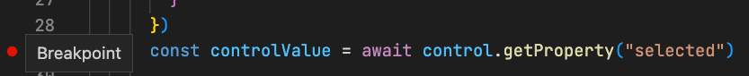
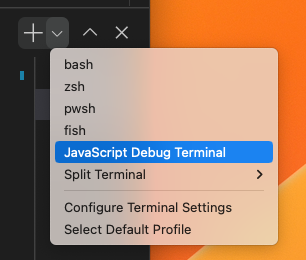
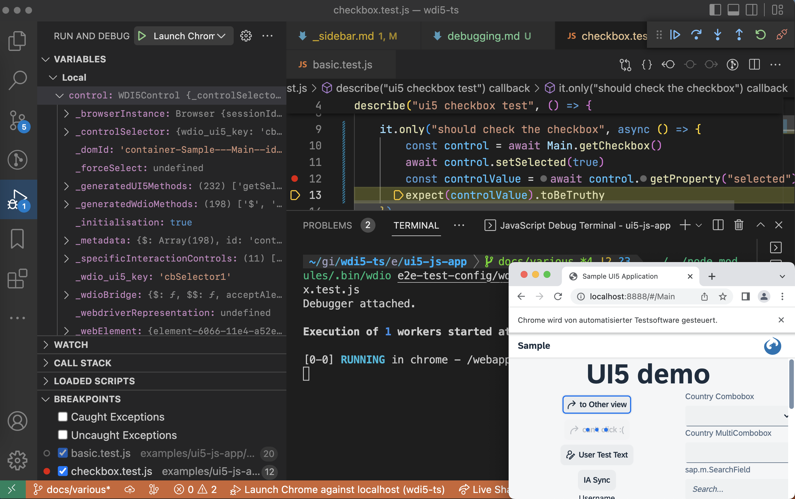

# Debugging `wdi5` tests

## with VS Code

Add breakpoints in the test source:  

In the `Terminal` are of VS Code, start a "JavaScript Debug Terminal"...  
  
...and run `wdi5` from there...

- via `npm run wdi5` (or whatever npm script name you've chosen)
- directly via the `wdio` binary
  (in `/examples/ui5-js-app` of this repo)
  `$> ../../node_modules/.bin/wdio e2e-test-config/wdio-webserver.conf.js --spec /basic.test.js`

Subsequently `wdi5` will halt execution at that breakpoint and allows inspecting things in the Debugger pane:

