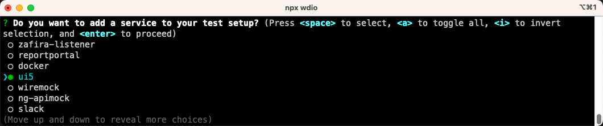
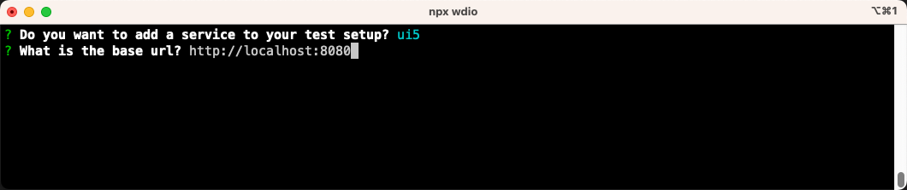

# Installation

With `wdi5` [being a service to WebdriverIO](https://webdriver.io/docs/wdio-ui5-service), installation of both is required.

## Prerequisites

- UI5 app running in the browser, accessible via `http(s)://host.ext:port`.
  Recommended tooling for this is either the official [UI5 tooling](https://github.com/SAP/ui5-tooling) (`ui5 serve`) or some standalone http server like [`soerver`](https://github.com/vobu/soerver) or [`http-server`](https://www.npmjs.com/package/http-server).
- Node.js version >= `14` (`lts/fermium`)

The installation of `wdi5` and WebdriverIO can either be done by using the [Webdriver.IO `cli`](https://webdriver.io/docs/gettingstarted.html) (recommended) or manually.

## guided install via `wdio` cli

?> This step assumes that you have neither installed WebdriverIO nor `wdi5` previously for that UI5 app. If so, see [manual install](#manual-installation) below.

On the console, change into the folder with the UI5 app you want to test.

```shell
$> cd any/ui5/app
```

Then let the `@wdio/cli` guide you through the setup process, including installation of `wdi5` aka `wdio-ui5-service`.  
(In this example, we'll do a minimum install for running `wdi5`/`wdio`

- locally
- with Chrome as target browser
- plain JavaScript as notation
- `mocha` as the syntax for tests
- `spec` as the output format of the test results

The variety of choices in the guided install should already give you a taste of how flexible `wdio` is!
)

```shell
$> npx wdio
```


!> Don't forget to check `ui5` at the stage "Do you want to add a service to your test setup?"



If you use the [ui5-tooling](https://sap.github.io/ui5-tooling/) for serving your UI5 app under test, then the default base url is <http://localhost:8080>.

If your UI5 app lives on any other URL, put the the FQDN including the path right up to, but not including, `index.html` there, e.g. <https://ui5-app.cfapps.eu10.hana.ondemand.com/some/sub/dir>



As the final step, let the cli do the `npm install` for you:


At the end of the guided installation, you'll be greated with a message similar to  
`🤖 Successfully setup project at /Users/you/any/ui5/app 🎉`

:arrow_right: Continue with the [configuration](configuration) now.

## reinitialize setup

If you have issues with your `wdio.conf.(j|t)s` file or want to reinitialize the guided installation:

```shell
$> npx wdio config
```

## manual installation

In case you already have a `wdio.conf.(j|t)s` file, getting `wdi5` is a straightforward process.

In a terminal, change to the directory holding your `wdio` conf file.

```shell
$> cd any/ui5/app
```

Install `wdi5` with its' technical name `wdio-ui5-service`:

```shell
$> npm install --save-dev wdio-ui5-service
```

Add that service to the respective section in `wdio.conf.(j|t)s`:

```javascript
//...
services: [
  // other services like 'chromedriver'
  // ...
  "ui5"
]
//...
```

:tada: Done! Proceed to [configuring wdi5](configuration) now.
