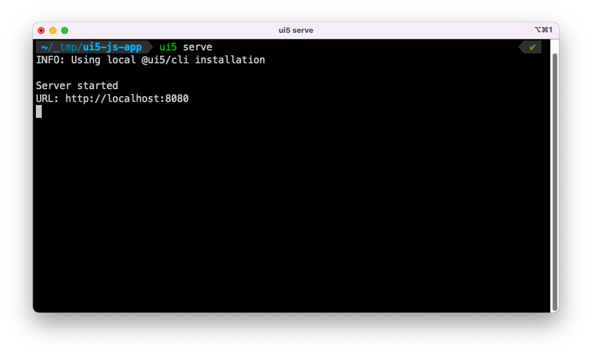

# Running `wdi5`

Two components are involved for executing `wdi5`-tests:

1. a webserver delivering your UI5 application
2. the WebdriverIO cli to run the `wdi5`-tests
3. [test files](/usage#test-suites) (default: `$ui5-app/webapp/test/*.test.(j|t)s`)

First, start the UI5 app, e.g. via [the ui5-tooling](https://sap.github.io/ui5-tooling/) (`ui5 serve`).



Then, kick off the test(s) via `wdio` (that, for best practice, should be wrapped in an npm script. Here: `npm run test:ui5tooling`).


To start the test without creating an npm script:

```shell
$> npx wdio run wdio-ui5tooling.conf.js "--spec" "basic"
```

Voilà!
